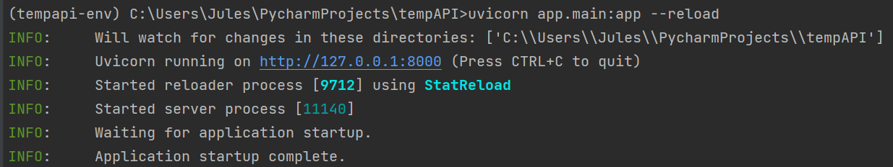

#Instructions
##Requirements
Python: `https://www.python.org/downloads/`

##Setup
1. Clone repository
2. Move to repository root folder: `cd ./tempAPI`
3. Create virtual environment: `py -m venv tempapi-env`
4. Activate virtual environment: `tempapi-env\Scripts\activate`
5. Install requirements: `pip install -r requirements.txt`
6. Start uvicorn server: `uvicorn app.main:app --reload`
7. Verify server is up:
