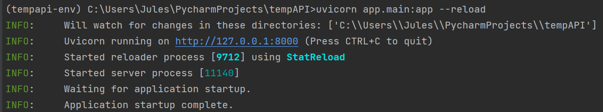
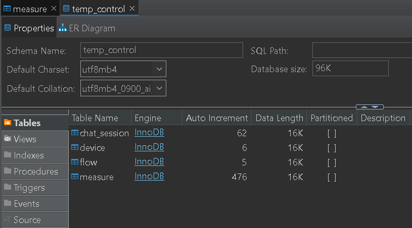
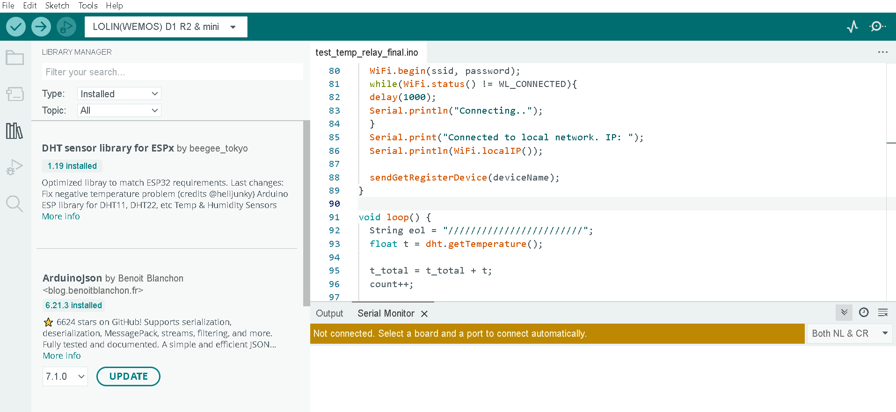

# Instructions
## Requirements
Python: `https://www.python.org/downloads/`

MySQL: `https://dev.mysql.com/downloads/installer/`

Arduino IDE: `https://www.arduino.cc/en/software`

## API Setup
1. Clone repository
2. Move to repository root folder
3. Create virtual environment: `py -m venv tempapi-env`
4. Activate virtual environment: `tempapi-env\Scripts\activate`
5. Install requirements: `pip install -r requirements.txt`
6. Start uvicorn server: `uvicorn app.main:app --reload`
7. Verify server is up:

#### NOTES: 
A sample `.common_config_template` file is provided, rename the file to `.common_config` and provide the expected values for:

- Twilio credentials
- AWS credentials
- AWS bucket information

A sample `.db_config_local_template` file is provided, rename the file to `.db_config_local` and provide the expected values for:

- DDBB credentials

Postman collection to test the API endpoints can be found at: `./postman`

## DDBB Setup
1. Move to sql dump directory: `cd ./sql_dump`
2. Import the database using the dump file: `dump-temp_control.sql`
3. Verify database was imported using a MySQL client:

## Arduino Setup
1. Open Arduino IDE
2. Connect the arduino board to any available USB port
3. Arduino IDE identifies the board and downloads the required drivers
4. Open the library manager and install the following libraries:

5. Click the checkmark button to verify the code
6. Select to Upload the sketch to the Arduino board